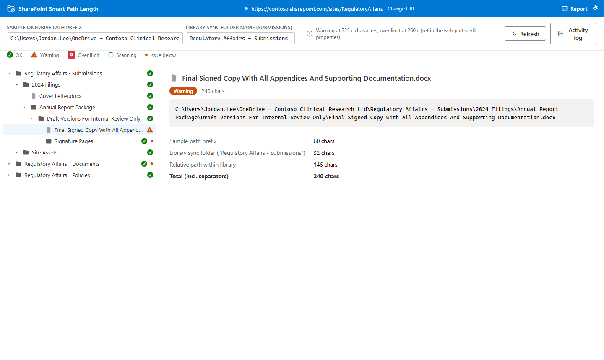
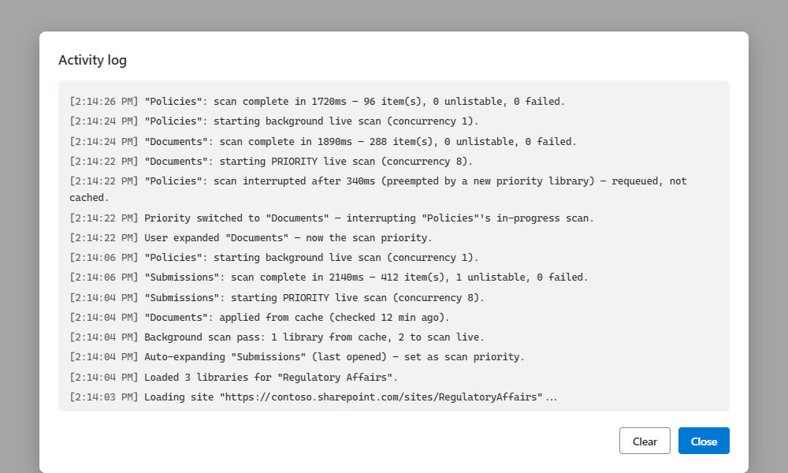
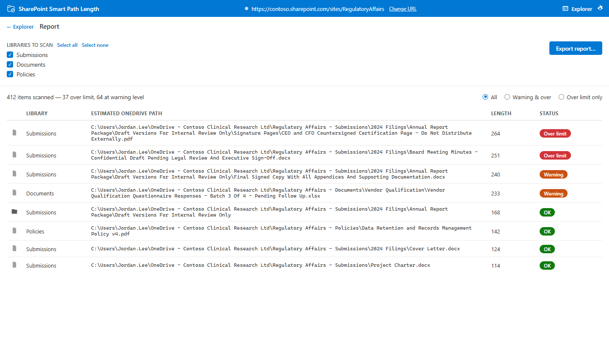
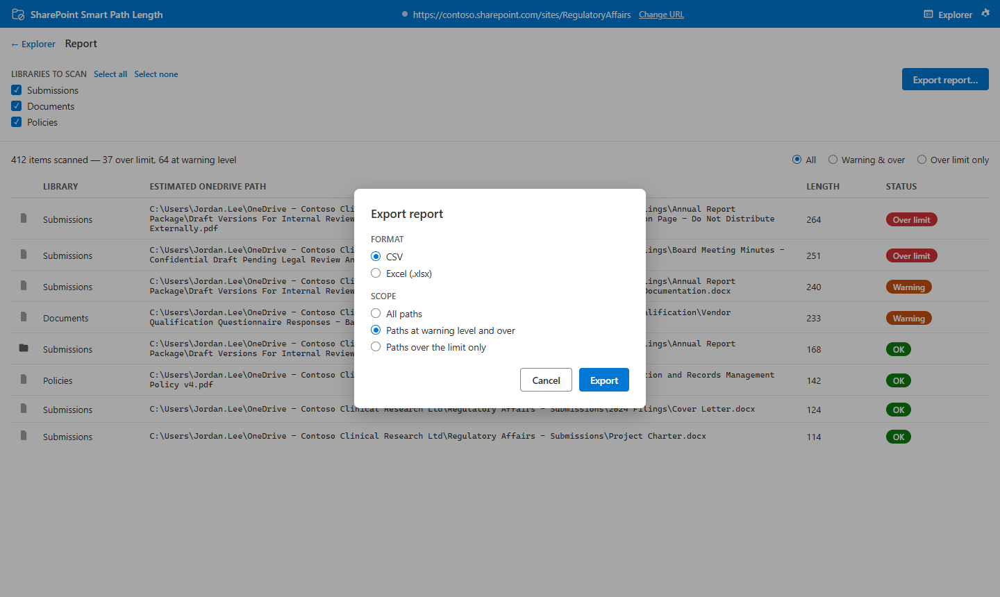
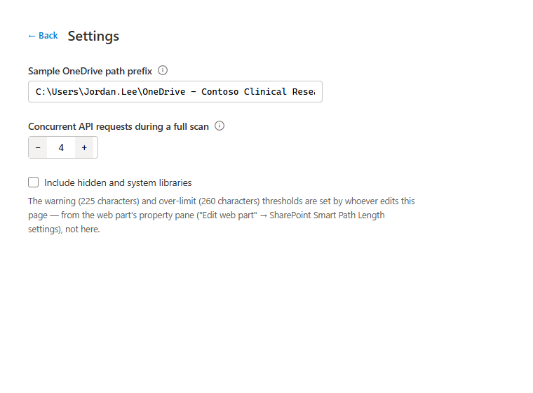

# SharePoint Smart Path Length — User Guide

**Version 1.1.0**
**Applies to:** SharePoint Online

---

## Table of Contents

1. [Overview](#overview)
2. [Who Is This For?](#who-is-this-for)
3. [Getting Started](#getting-started)
4. [Explorer](#explorer)
5. [Report](#report)
6. [Settings](#settings)
7. [Web Part Configuration](#web-part-configuration)
8. [Understanding the OneDrive Path Estimate](#understanding-the-onedrive-path-estimate)
9. [Frequently Asked Questions](#frequently-asked-questions)
10. [Troubleshooting](#troubleshooting)

---

## Overview

**SharePoint Smart Path Length** is a browser-based tool built directly into SharePoint Online as a web part. It finds files and folders whose paths would be too long once a document library is added as a "Shortcut to OneDrive" — before your users hit sync failures, not after.

Windows has historically capped file paths at 260 characters. When someone adds a SharePoint library as a OneDrive shortcut, the local path their computer creates combines their OneDrive sync folder, a folder named after the site and library, and the item's full path inside that library. Nest a few folders deep with descriptive names, and that combined path can quietly cross 260 characters — at which point OneDrive can't sync the file, usually with an error message that doesn't explain why.

This tool estimates that combined path for every file and folder on your site and flags anything close to or over the limit, so you can rename or restructure before it becomes a support ticket.

### What You Can Do

| Tool | Purpose |
|---|---|
| **Explorer** | Browse a site's document libraries as a tree, with a status icon and full path breakdown for every item |
| **Report** | Scan one or more entire libraries and export a CSV or Excel report of paths at or near the limit |

---

## Who Is This For?

- **Site Owners** preparing a library for OneDrive sync or "Add shortcut to OneDrive"
- **IT Administrators** troubleshooting reports of OneDrive sync failures
- **Content Owners** planning a folder structure or migration who want to catch naming problems early

> **Note:** The web part runs as the currently signed-in user and only reads document libraries you already have access to view.

---

## Getting Started

### Prerequisites

- No special permissions are required beyond normal read access to the site's document libraries — anyone who can browse a library in SharePoint can use this tool.
- A site owner must add the web part to a page first (see below).

### Accessing the Web Part

The web part is added to a SharePoint page by a site owner or page editor. Once added, navigate to that page — the **Explorer** opens automatically.

---

## Explorer

### What It Does

The Explorer shows every document library on the site as an expandable tree. Each folder and file carries a status icon — green (OK), amber (warning), or a bold red badge (over the limit, deliberately shaped and colored to stand out from the others at a glance) — reflecting **that item's own** estimated OneDrive shortcut path length. A folder's icon never turns amber or red just because something inside it is flagged; that's what the small dot next to its icon is for (see below). Hover over any icon, including the ones in the icon legend at the top of the Explorer, to see exactly what it means.

When you open the Explorer, it automatically expands the library you had open last time you visited this site (or the default "Documents" library, the first time). It also checks the rest of the site in the background, so a library or folder you haven't opened yet can still show a warning or over-limit dot — not just the ones you've expanded.



### How to Use It

1. Click a folder's row (or its chevron) to expand it and load its contents.
2. Click any file or folder to select it. The right-hand panel shows:
   - The full estimated OneDrive path.
   - A character-count breakdown: sample path prefix + library sync folder name + relative path = total.
3. A small dot next to a folder's icon means a descendant somewhere inside it is at warning level (amber) or over the limit (red) — this shows whether the folder is expanded or collapsed, since expanding one level doesn't reveal problems that are further down than that.
4. While a library's background check is still running, its folders show a spinner alongside their status icon — the icon itself (an item's own length) is always accurate right away; it's only the dot (anything below it) that isn't final until the spinner goes away. The background check pauses automatically while a page editor is editing the page, and results are kept in your browser for about an hour so repeated visits in the same session don't repeat the check unnecessarily. Hover a library's icon to see whether its current check came from that cache or a live scan, and how long ago.
5. Click **Refresh** in the toolbar at any time to force a live re-check of every library, ignoring cached results — useful if you know content has changed recently and want current answers immediately.
6. Click **Activity log** in the toolbar to see a timestamped record of what the background scanner has actually been doing — scans starting and finishing, cache hits, libraries being interrupted so a newly-viewed one can jump ahead, and any folders that failed to load. Handy if a status looks like it's taking a while to appear and you want to know why.

   

7. Edit the **Sample OneDrive path prefix** field at the top to match a real user's OneDrive folder (e.g. `C:\Users\Jordan\OneDrive - Contoso\`) and every length in the tree recalculates immediately.
8. Once you've selected an item, a **Library sync folder name** field appears — this is the tool's best guess at what OneDrive will actually call the synced library locally (normally `{Site Name} - {Library Name}`). If you know the real synced folder name differs, type it in and the whole library's estimates update.

### Keyboard Navigation

The tree supports full keyboard control: **Arrow Up / Down** move between visible rows, **Arrow Right** expands a folder (or moves into it if already expanded), **Arrow Left** collapses a folder (or moves to its parent), **Home** / **End** jump to the first or last visible row, and **Enter** or **Space** activates the focused row.

---

## Report

### What It Does

The Report runs a full recursive scan of one or more entire libraries — not just the parts you've expanded in the Explorer — and lets you filter and export the results.



### How to Use It

1. Click **Report** in the banner (it toggles to **Explorer** once you're on the Report screen, so you can switch back).
2. Choose which libraries to scan, or use **Select all** / **Select none**.
3. Click **Run full scan**. A live count shows progress; click **Cancel** at any time to stop (an item already being read completes before the scan actually halts).
4. Once finished, filter the results table: **All**, **Warning & over**, or **Over limit only**.
5. Click **Export report…** and choose:
   - **Format** — CSV or Excel (the Excel version color-codes rows by severity).
   - **Scope** — which of the three filters to export (defaults to whatever you're currently viewing).

   

---

## Settings

Click the **gear icon** in the banner to open Settings. These are saved to your own browser only — they don't affect what other people see:



- **Sample OneDrive path prefix** — the same field available in the Explorer toolbar, in case you'd rather set it once here.
- **Concurrent API requests during a full scan** — how many requests the Report view fires in parallel; lower this if a scan is getting throttled.
- **Include hidden and system libraries** — off by default; turn on to also scan libraries SharePoint normally hides.

The warning and over-limit thresholds are **not** set here — see Web Part Configuration below.

---

## Web Part Configuration

A page editor sets these from **Edit web part** in the property pane — they apply to everyone who views the page:

| Setting | Default | Description |
|---|---|---|
| **Warning length (characters)** | 225 | Paths at or above this length are flagged amber |
| **Over-limit length (characters)** | 260 | Paths at or above this length are flagged red; must be greater than the warning length |
| **Default sample OneDrive path prefix** | `C:\Users\UsernamePath\OneDrive - Company\` | The starting sample path shown to every viewer; anyone can still override it for their own session from the Explorer or Settings |

---

## Understanding the OneDrive Path Estimate

Every length shown by this tool is built from three pieces, joined with backslashes:

```
<sample path prefix> \ <library sync folder name> \ <relative path within the library>
```

For example:

```
C:\Users\Jordan\OneDrive - Contoso\  +  Clinical - Documents  +  Reports\2024\Q4 Summary.docx
```

- The **sample path prefix** is your local OneDrive sync root — it varies by tenant name and, in a few tenants, by user.
- The **library sync folder name** defaults to `{Site Name} - {Library Name}`, the common OneDrive naming pattern — but Microsoft doesn't document or guarantee this, and it can differ (a renamed library, or a name collision that gets a numeric suffix from OneDrive). Override it in the Explorer once you know the real value for your tenant.
- The **relative path** is exactly what it looks like in SharePoint — every folder name from the library root down to the file, plus the file name itself.

Because the prefix and sync folder name apply to an entire library at once, getting them right for even one item makes every other estimate in that library accurate too.

---

## Frequently Asked Questions

**Does this tool actually move, rename, or delete anything?**
No. It only reads file and folder names and lengths — it never changes SharePoint content.

**Why does a path look different from what I see in File Explorer?**
The tool estimates what OneDrive *would* create locally — check that your sample path prefix and library sync folder name match your actual OneDrive folder (see Explorer, above).

**Can two different people see different results?**
Yes, deliberately — the sample path prefix is per-browser, so each person can check against their own OneDrive folder name. The warning and over-limit thresholds, however, are the same for everyone (set by the page editor).

**Does a full scan affect SharePoint performance?**
It makes a request per folder, similar to browsing that many folders manually. Lower the concurrency in Settings if you notice throttling on a very large library.

**Does just opening the Explorer make extra requests to SharePoint too?**
Yes — the Explorer automatically checks each library in the background so status icons are accurate before you've expanded everything, similar in spirit to the Report's full scan. The library you're actually looking at is checked at full speed; every other library is checked much more slowly so it doesn't compete with what you're doing, and switching which library you're viewing redirects that effort immediately. This background check also pauses automatically while a page editor is editing the page, and caches its results in your browser for about an hour so repeated visits don't repeat it unnecessarily.

**How do I know if a status came from the cache or a fresh check?**
Hover a library's status icon — the tooltip says whether it was checked live or came from cache, and how long ago. If you want current answers right now regardless, click **Refresh** in the toolbar.

**Something seems stuck or slow — how can I tell what's happening?**
Click **Activity log** in the toolbar for a timestamped record of every scan starting, finishing, being interrupted, or hitting cache — often more useful than guessing from the icons alone.

---

## Troubleshooting

**"Warning length must be less than the over-limit length" in the property pane** — adjust either threshold until the warning value is smaller than the over-limit value.

**A path's length looks off by a few characters** — the library sync folder name is a best guess; override it in the Explorer toolbar with the real value for your tenant (see [Understanding the OneDrive Path Estimate](#understanding-the-onedrive-path-estimate)).

**A full scan is slow or shows a throttling-related error** — open Settings and lower "Concurrent API requests during a full scan," then try again.

**Clicking Cancel doesn't stop the scan immediately** — one request already in flight per library finishes before the scan actually stops; this is expected.

**A folder shows "Couldn't list this folder's contents... HTTP 406"** — SharePoint itself is refusing to list that folder because a path somewhere in or under it is too long for SharePoint's own API to describe, regardless of how the tool asks for it. The tool automatically tries an alternate way of looking up the same folder, which usually still works even here — if you see this message anyway, that fallback didn't succeed either, and the folder is treated as proof it needs attention (marked over the limit) even though its contents beyond that point can't be shown. This is a SharePoint limitation, not a tool malfunction.

---

Questions or feedback? Visit [sharepointsmartsolutions.com](https://sharepointsmartsolutions.com/sharepoint-smart-path-length).
